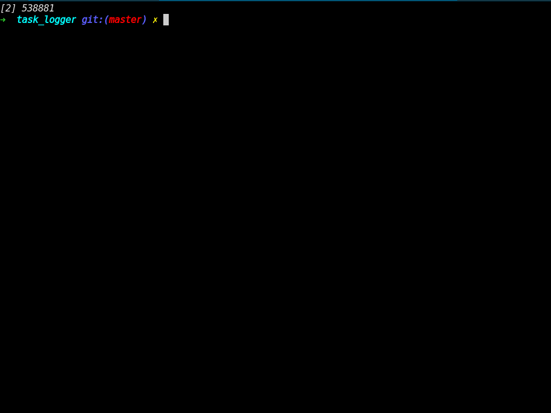

[](https://circleci.com/gh/delbetu/task_logger/tree/master)
[](https://www.codacy.com/app/delbetu/task_logger?utm_source=github.com&amp;utm_medium=referral&amp;utm_content=delbetu/task_logger&amp;utm_campaign=Badge_Grade)

# Task logger

Command line tool for logging your daily tasks.
The main two features that it offers are:
* User wants to log an activity (i.e. Spent 1 hour preparing the sprint planning meeting).
* User wnats to see all the activities that he has logged today.
* User wants to remove some existing activities because we introduced a wrong number of hours.
* At the end of the day user wants to report these activities to [minutedock](https://minutedock.com/) service.



## The Model
To support these functional behavior I decided to model using value objects:

`EntryValue`  --> `Project`  
   |------------> `Category`

Each EntryValue represent a time spent on some Task.
The task is represented by the EntryValue description.
Project and Categories are preconfigured read-only lists, that you can find under `config/` directory.

## Installation

You will need ruby and bundler installed.
```bash
git clone git@github.com:delbetu/task_logger.git
cd task_logger
bundle install
```

## Runnig test

```bash
bundle exec rspec
```

## Running and usage

### Configure categories and projects

When logging a task you will be prompted to select a category and a project.
Those lists are loaded from the `proyects.yml` and `categories.yml`.

Copy samples and edit them in the way that better fits your job.
```bash
mkdir db
cp config/projects.yml.example config/projects.yml
cp config/categories.yml.example config/task_categories.yml
```

### Configure external services

If you have a [minutedock](https://minutedock.com) account you can send
the tasks you have logged to this service.

Get your api keys from minutedock.
```bash
cp config/minutedock_credentials.yml.example config/minutedock_credentials.yml
```
Edit this file and paste your credentials.

### Usage

Run
```bash
./bin/task_logger
```
and answer the questions.

## Development Process

This project was developed using Outside-In TDD.
Every commit is a baby step easy to understand.

## Architecture decisions

The pieces of code are divided on **UI**, **Interactor** and **IO-Objects**.

UI -> Interactor -> IO-Object (MinutedockProxy, FileStorage)

The application is composed of these object-stereotypes, each of them obeys a different purpose.

Interactors offer functionality to UI and split the process into a set of tasks

**UI**
  - Manage user data flowing in and out of the system.
  - Sends message to Interactors

**Interactor**
  - Recieves petitions from the UI
  - Implements bussiness logic by Interacting with IO-Objects

**IO-Objects**
  - Interact with one IO-device (storage or network) by wrapping a third-party library.

### Development process

This was build using TDD.
First thinking of how UI would interact with user and then deciding what functions the Interactor object should provide.
Then start proggramming the outer TDD loop over the interactor stubbing out IO-objects.
After that, the interface for the IO-object is revealed so the inner TDD loop over the IO-object starts.

## Feel free to comment
